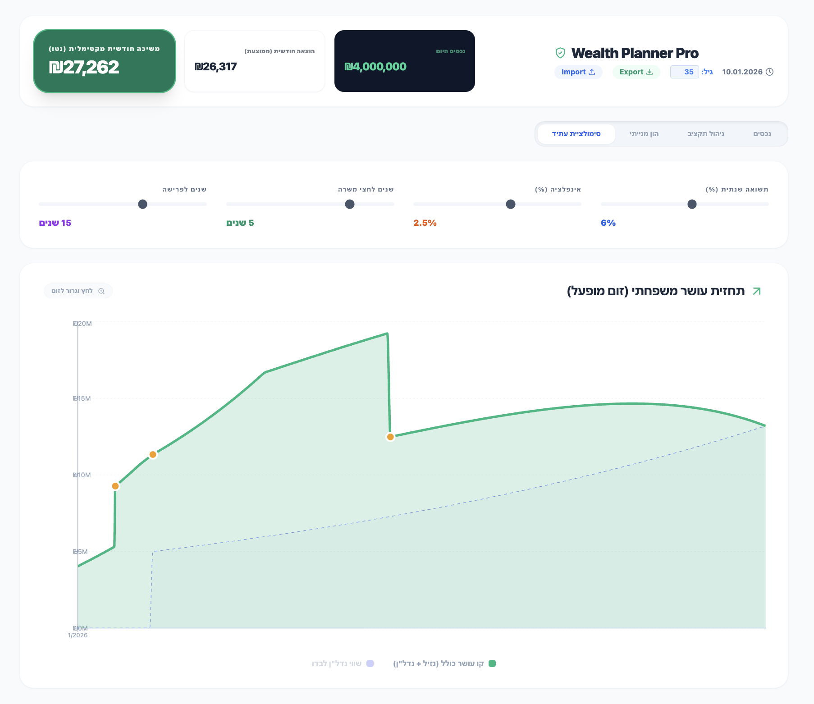

# Prisha - Personal Financial Planning Dashboard

A comprehensive wealth planning and retirement simulation application built for Israeli households. The app helps track assets, manage budgets, simulate equity vesting, and plan for early retirement with accurate Israeli tax calculations.

---

## למה עוד מחשבון פרישה?

יש מחשבונים טובים בשוק (כמו של [הסולידית](https://www.hasolidit.com/%d7%9e%d7%97%d7%a9%d7%91%d7%95%d7%9f-%d7%a2%d7%a6%d7%9e%d7%95%d7%aa-%d7%9b%d7%9c%d7%9b%d7%9c%d7%99%d7%aa)), אבל המחשבון הזה עושה כמה דברים אחרת:

### 1. סימולציית אופציות בסטארטאפים
אפשר להכניס אופציות ממספר חברות שאתם או בני/בנות הזוג עובדים בהן, ולהסתכל על תרחישי אקזיטים שונים - כולל חישוב מס רווחי הון, מס יסף, ומחיר מימוש.

### 2. התייחסות לאינפלציה לאורך כל החיים
הגרף מראה כמה תצטרכו למשוך בכל חודש לאורך כל החיים **בהתחשב באינפלציה**. כלומר, אם היום אתם צריכים 20,000 ₪ לחודש, בעוד 20 שנה תצטרכו הרבה יותר כדי לשמור על אותה רמת חיים.

### 3. מקסום הוצאות, לא מקסום ירושה
המטרה של המחשבון היא לסיים את החיים רק עם הנכס שקניתם - לא למות עשירים מדי. במקום למשוך 4% קבוע מהתיק, המחשבון מחשב את **המקסימום** שאפשר למשוך מרגע הפרישה עד סוף החיים.

### 4. מנוע מיסוי ישראלי מלא
חישוב מס הכנסה לאורך כל החיים:
- **משיכה מהשקעות**: מס רווחי הון 25% + יסף מעל 721,560 ₪
- **משיכה מפנסיה לפני גיל 60**: מדרגות מס הכנסה שלא מיגיעה אישית (מתחיל ב-31%)
- **קצבת פנסיה אחרי גיל 60**: המרה לקצבה לפי מקדם 210, מס 15%
- **אופציות**: מס רווחי הון + יסף לפי מחיר מימוש

### 5. פרישה הדרגתית (Coast FIRE)
אפשר לבחור לרדת לחצי משרה אחרי מספר שנים, ורק אחר כך לפרוש לגמרי. המחשבון מתייחס להפרשות פנסיה מופחתות בתקופת חצי המשרה.

### 6. אתם בוחרים מתי לפרוש
במקום שהמחשבון יגיד לכם "עוד X שנים עד הפרישה", אתם מחליטים מתי לפרוש והמחשבון מחשב כמה כסף תוכלו למשוך כל חודש עד סוף החיים.

### מגבלות ידועות
- **אין laddering**: המחשבון מניח תשואה אחידה על כל התיק. בפועל, כשפורשים מוקדם כנראה לא תרצו לחשוף את כל הכסף למניות. אפשר לפצות על זה ע"י הנחת תשואה ממוצעת נמוכה יותר.
- **קצבת פנסיה פשטנית**: הקצבה מתקבעת בגיל 60 ועולה רק לפי אינפלציה. בפועל יש מודלים מורכבים יותר.

### איך להשתמש
הדרך הכי טובה להשתמש במחשבון היא עם [Cursor](https://cursor.sh/) או כלי AI דומה - תנו לו את ההוצאות החודשיות שלכם, את נתוני המסלקה הפנסיונית, והוא יכניס את הנתונים בעצמו לקוד. אחר כך תוכלו לשחק עם התרחישים השונים.

---



## Features

### Asset Management
- Track pension accounts, investment portfolios, and liquid assets
- Separate view for pension vs. investment holdings
- Real-time total wealth calculation

### Budget Tracking
- Monthly and yearly expense management
- Salary tracking (gross and net) for household members
- Automatic savings rate calculation

### Stock Equity Simulation
- Track equity vesting schedules for multiple companies
- Support for cliff periods and linear vesting
- Exit scenario modeling (acquisition, IPO)
- Net equity calculation after Israeli capital gains tax

### Retirement Planning
- Multi-phase retirement simulation:
  - Full-time work → Half-time work → Full retirement
- Find optimal monthly withdrawal rate
- Property purchase planning and rent elimination modeling
- Configurable parameters: return rate, inflation, timeline

### Israeli Tax Engine
- Accurate marginal tax brackets for employment income
- Early pension withdrawal tax (before age 60) with 31%+ brackets
- Capital gains tax (25%) with surtax above ₪721,560
- Pension annuity conversion at age 60 (coefficient method)
- 15% pension income tax

## Tech Stack

- **Framework**: React 18 with TypeScript
- **Build Tool**: Vite
- **Charts**: Recharts
- **Icons**: Lucide React
- **Testing**: Vitest with Testing Library
- **Storage**: localStorage (auto-save with debounce)

## Getting Started

```bash
# Install dependencies
npm install

# Run development server
npm run dev

# Run tests
npm test

# Build for production
npm run build
```

## Project Structure

```
src/
├── App.tsx              # Main application component
├── main.tsx             # Entry point
├── types.ts             # TypeScript interfaces
├── utils/
│   └── calculations.ts  # Financial calculation functions
└── test/
    ├── setup.ts         # Test configuration
    └── calculations.test.ts  # Unit tests
```

## Key Calculations

The simulation engine (`calculations.ts`) handles:

- **Net equity after taxes**: Capital gains + surtax calculation
- **Vesting schedules**: Linear vesting with cliff support
- **Budget summaries**: Monthly expense aggregation
- **Optimal withdrawal**: Binary search for maximum sustainable withdrawal
- **Marginal tax**: Israeli bracket-based tax calculation
- **Pension annuity**: Fixed coefficient (210) conversion at age 60

## Configuration

Default values are set for a specific household but can be adjusted in the UI:

- Initial assets and their types (pension/liquid/investment)
- Monthly and yearly expenses
- Salary data for both household members
- Stock option contracts with vesting schedules
- Property purchase plans
- Simulation parameters (return rate, inflation, timeline)

## Language

The UI is in Hebrew with right-to-left (RTL) layout, designed specifically for Israeli users.

## License

This project is free to use and modify, but you must give credit to **Uri Harduf (אורי הרדוף)** as the original author. See [LICENSE](LICENSE) for details.
